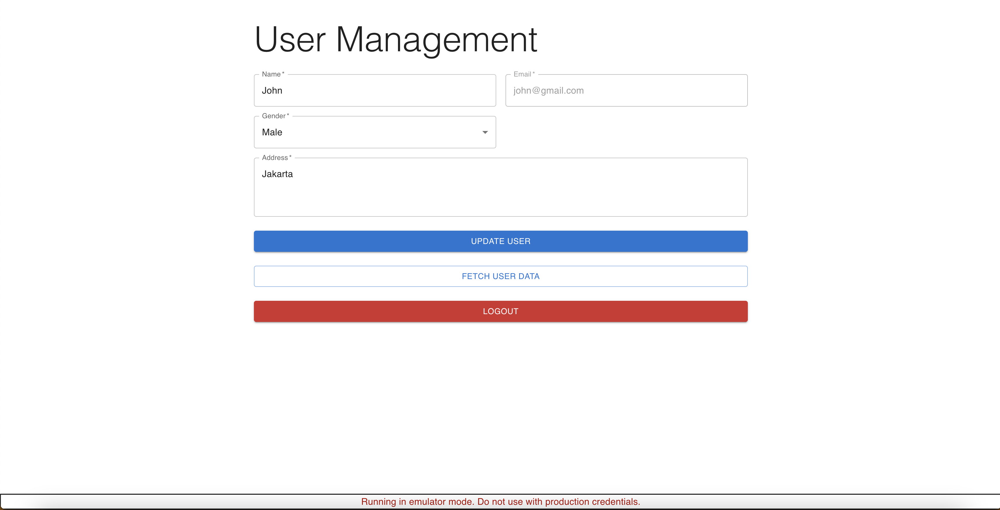

# Turborepo starter

There are apps in this repository

- backend
- frontend

## How to run

1. Use node v18
2. Clone this repository
3. Run `npm i -g firebase-tools`
4. Run `npm install`
5. Run `npm run dev`
6. Open http://localhost:3000

## Screenshots

Login Page

Register Page

Home Page

